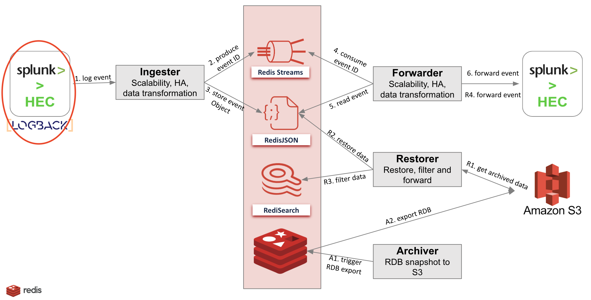

# Splunk-Logback Agent
The corner stone of our solution is Redis Enterprise. Redis Enterprise is a key-value on-memory database that offers automatic failover and replication to avoid data loss.
High and linear scalability to provide a tremendous throughput and a very low latency (sub milliseconds) when reading and writing data.
The solution consists of a Redis Enterprise cluster and several components (upstream and downstream of Redis Enterprise):

1. The ingester: following a publisher/subscriber architecture, this module listens to the Splunk agent (intercepts HTTP events) and produces data as JSON documents and put their ID in the `forward` Stream.
   To provide scalability, there can be several instances of the ingester behind a load-balancer (haproxy, nginx).
2. The forwarder : this module subscribes to the `forward` stream fed by the ingester module.
   For each received event, the forwarder gets the payload from the key and sends it to the Splunk HEC (Http Event Collector).
   If the payload is rejected for any reason, the forwarder stores the payload in the dead-letter queue for analysis and delivery retry.
3. The archiver: this module subscribes to the "event" stream and checks that “ingesters” and `forward` streams are empty. Then it triggers an hourly RDB backup to S3.
4. The restorer: on a “restore” message (from Admin API), this module restores one hourly RDB backup from S3 (JSON+Stream), it creates Redis Search indexes (FTSEARCH) and use them with provided filter criteria to UNLINK unwanted items (to keep only the required elements: by user, by host and by Splunk index)

This repository implements a Sample Logging Agent to send messages (Java logging using logback) to Splunk HTTP Event Collector (HEC)



## Usage
Clone the Repository:
```
git clone https://github.com/amineelkouhen/redis-splunk-agent.git
```

Execute the Following Commands:
```
./gradlew fatJar
```
Then, 
```bash
java -jar \
-Dlogback.configurationFile=config/logback.xml \
-Dsplunk.url=<HEC_ENDPOINT> \
-Dsplunk.token=<HEC_TOKEN> \
-Dsplunk.index=<HEC_INDEX_NAME> \
-Diter=1 \
build/libs/redis-splunk-agent-1.0.0.jar
```

Example:
```bash
java -jar \
-Dlogback.configurationFile=config/logback.xml \
-Dsplunk.url=http://localhost:8686 \
-Dsplunk.token=RedisToken12345 \
-Dsplunk.index=main \
-Diter=1 \
build/libs/redis-splunk-agent-1.0.0.jar
```